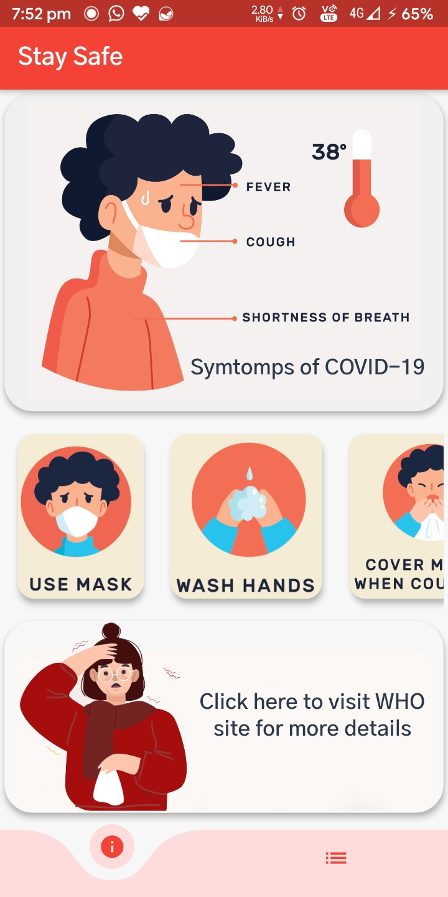
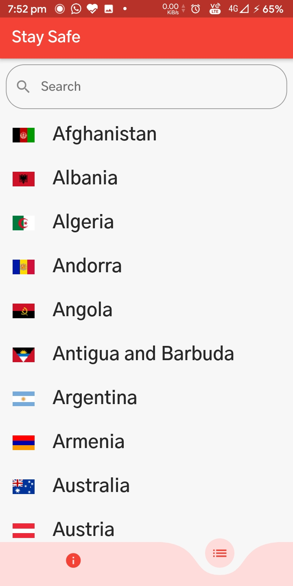
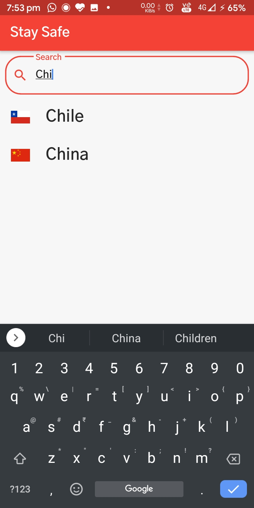
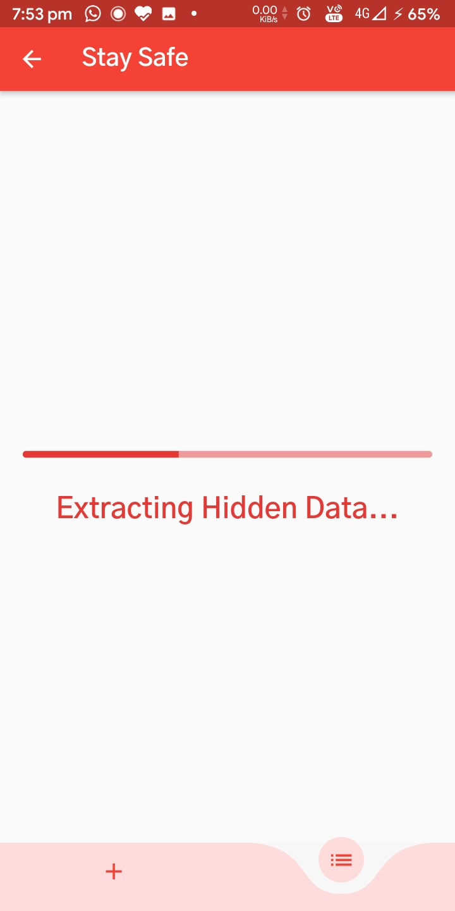
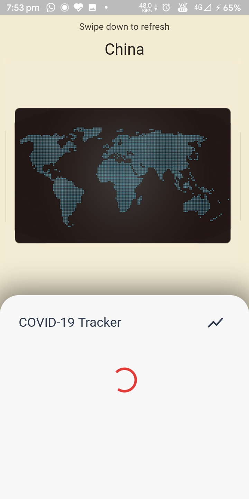
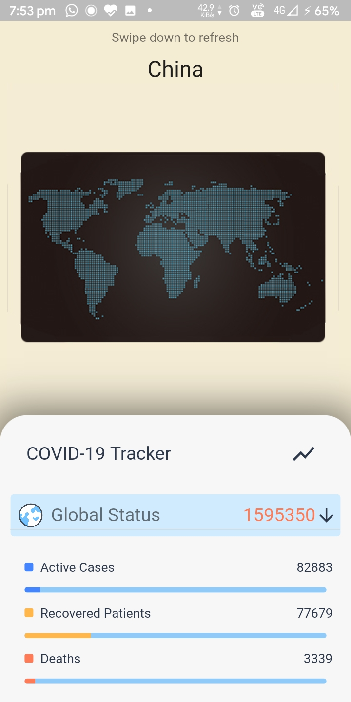
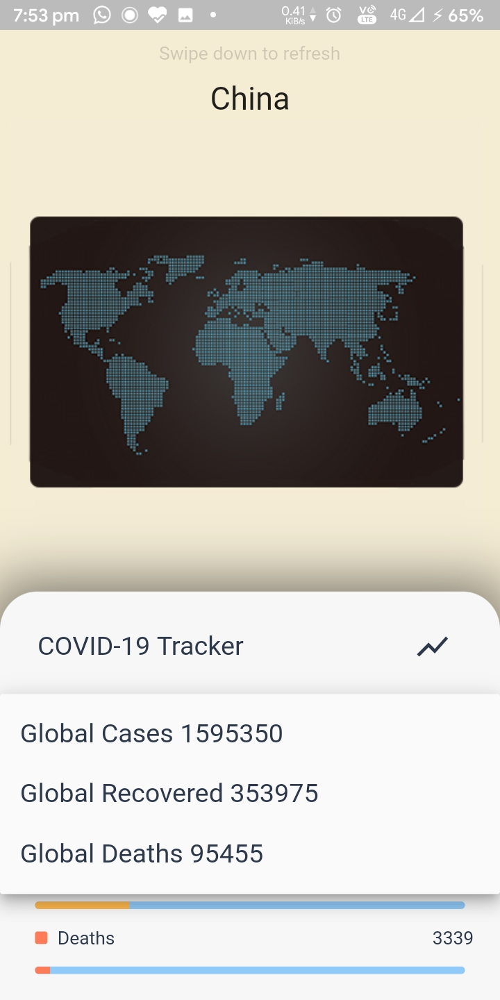
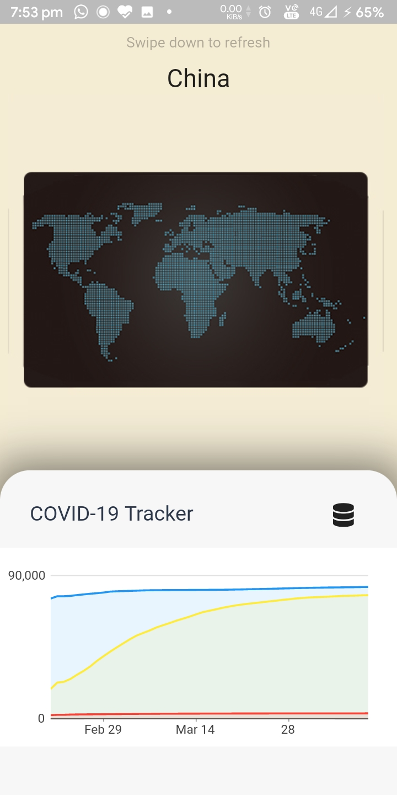

# Stay Safe Coronavirus Tracker Flutter App

This app basically tracks the total cases of infected persons (real-time data), in all countries with total deaths and recovered cases too.
It features beautiful UI with custom animations. It has charts, global info, symtomps and other COVID-19 related info and much more stuff.

## Things to do

- [ ] Implement pull to refresh efficiently
- [ ] Show top countries in a list on Info page
- [ ] Improve the Bottom Nav Bar with animations
- [ ] Change tabs by swiping between them
- [ ] Chnage countries by swiping between them on ResultPage
- [ ] Include Dark mode

## Demo

